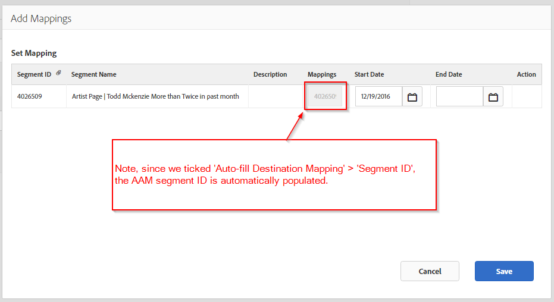

# Integrating AAM (Adobe Audience Manager) with LinkedIn

Learn how to create a LinkedIn URL-based Destination in AAM (Adobe Audience Manager) for pushing AAM segments for online ad targeting.

## Description {#description}

### Environment

- Adobe Audience Manager (AAM)
- LinkedIn

### Issue/Symptoms

AAM Segments created in AAM UI ready to assign to LinkedIn Destination. See [Create a Segment](https://experienceleague.adobe.com/docs/audience-manager/user-guide/features/segments/segment-builder.html#create-segment)in Audience Manager User guide.

This article is a guide to the process of creating a LinkedIn URL-based Destination for the purposes of pushing Adobe Audience Manager (AAM) segments to LinkedIn for online ad targeting.

<b>Note:</b> This method is a workaround offered to support you in leveraging your AAM segments within the LinkedIn platform. Any LinkedIn UI updates or issues must be taken up with your respective LinkedIn account representative.

## Resolution {#resolution}

1. Create a new URL Destination in AAM called *LinkedIn Audiences* with the following settings (see attached screenshot below):
    <b>Basic information </b>

    - Environment: All
    - Type: URL
    - Tick ‘Auto-fill destination Mapping’ and select ‘Segment ID’

    <b>Data Export Labels</b>
    Optional setting as per your needs
    <b>Configuration</b>

    - URL Type: Custom URL
    - Tick ‘Serialize’
    - Base URL: This will be where you enter the LinkedIn Pixel

    <b>Example</b>

    - *Base URL:<b></b>[http://dc.ads.linkedin.com/collect/?pid=XXXXX&fmt=gif&noscript=1&data=%ALIAS%](http://dc.ads.linkedin.com/collect/?pid=XXXXX&amp;fmt=gif&amp;noscript=1&amp;data=%25ALIAS%25)<b>*
    - *Secure URL:</b><b>[https://dc.ads.linkedin.com/collect/?pid=XXXXX&fmt=gif&noscript=1&data=%ALIAS%](https://dc.ads.linkedin.com/collect/?pid=XXXXX&amp;fmt=gif&amp;noscript=1&amp;data=%25ALIAS%25)</b>*

    <b>Where</b>

    - <b>*pid</b>* : is the LinkedIn Partner ID
    - <b>*%ALIAS%</b>*: is an AAM macro that will be dynamically replaced with the AAM segment IDs the user qualifies for, delimited by comma “,”

    <b>Example Pixel fired from page</b>
      <u><b><em><a href="https://dc.ads.linkedin.com/collect/?pid=51565&amp;fmt=gif&amp;noscript=1&amp;data=%25ALIAS%25" style="color:#0563c1; text-decoration:underline">https://dc.ads.linkedin.com/collect/?pid=51565&amp;fmt=gif&amp;noscript=1&amp;data=3401321,2993399,3263410</a></em></b></u>
      This example shows a user who falls into three segments or IDs: 3401321, 2993399, and 3263410.
      <b>Example URL Destination configuration</b>

2. Assign the applicable segment to the newly created destination. The mapping value is auto-populated with the AAM segment ID.
    Enter an end date if applicable or leave blank for no end date.
    

Now AAM will selectively fire the LinkedIn pixel, populating the Segment ID dynamically, qualifying the respective user for an Audience in LinkedIn.
