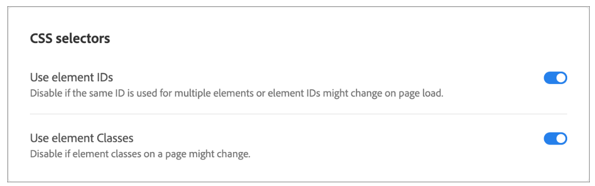

# Adobe Target: Unable to add link to image on page through VEC

## Description {#description}

<b>Environment</b>
 Adobe Target

<b>Issue</b>
 You may be able to create the activity through VEC where you are adding a Link to the Image.
 However with the QA URL / content delivery, the link might not work.

<b>Cause</b>
 This may be due to the fact that Adobe Target polls all the selectors before loading the DOM elements, and since this image id is created "on the run," the next action of applying link on this id is not executed, as the selector is not found.

## Resolution {#resolution}

<b>Solution</b>
In such scenarios, make the below changes to the activity where you are looking forward to edit the links of the image:

1. Edit the Activity.
2. Click on the G<b>ear</b> button and go to <b>Site Preferences</b>.

        

    

    

    

    

    

    

    

    

    

    

    

    

    

    

    

    

    

    

    
3. Disable <b>Use element IDs</b> and <b>Save</b> it.
4. Click on <b>Next</b> and <b>Save</b> the activity.

This should help to resolve the issue.
