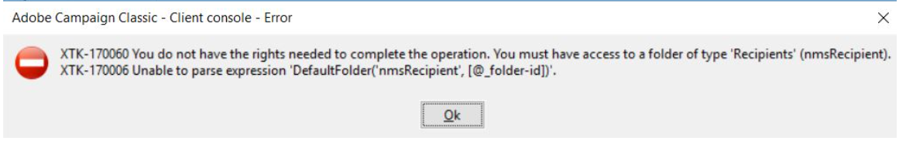

# Campaign Classic issue on not able to create create Recipients

Learn how to access the folder errors while trying to create a recipient from the form <b>Profiles and Target `>` </b> <b>Recipients on the instance.</b>

## Description {#description}

### <b>Environment</b>

Campaign Classic

### <b>Issue/symptoms</b>

While trying to create a recipient from the form <b>Profiles and Target `>`  Recipients</b> on the instance, users are getting rights to access the folder errors.

## Resolution {#resolution}

Once we added the Recipient folder by right-clicking on the folder form <b>Profiles and Target</b>, things started to work again.

<b>Cause</b>
This error occurs when the default folder Recipients is made view instead of making a separate view folder for it.
