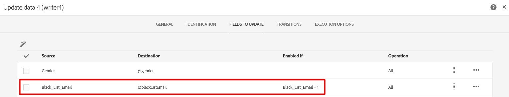

# blackListEmailLastModified is getting modified even when blacklistEmail is not modified

## Description {#description}


### <b>Environment</b>

Campaign Standard


### <b>Issue/Symptoms</b>

Use case - When importing profiles from a file one of the key properties they read from the file is blacklistEmail. As shown below, if using a conditional update on the source field to avoid unnecessary updates on the destination field.





<br>However, you may notice that the blackListEmailLastModified field gets modified for all existing profiles that are imported. The expected behavior is that the blackListEmailLastModified should only be modified when  blacklistEmail is modified.

Here's the generated SQL update:
<br>UPDATE NmsRecipient 
<br>   SET iGender=COALESCE( OutTbl.iFld1084817585, 0),
<br>       iBlackListEmail=COALESCE( CASE OutTbl.iEnaFld1086062770 WHEN 1 THEN OutTbl.iFld1086062770 ELSE NULL END, CASE WHEN OutTbl.iEnaFld1086062770=1 THEN 0 ELSE iBlackListEmail END),
<br>       iModifiedById=16107610,tsLastModified=$(curdate),
<br>       tsBlackListEmailLastModified=$(curdate),
<br>       tsBlackListAllLastModified=$(curdate) 
<br>  FROM wkf11373941_23_1 OutTbl 
<br> WHERE NmsRecipient.iRecipientId=OutTbl.iPKey_1 
<br>   AND OutTbl.iRecProcState`>` $(l) 
<br>   AND OutTbl.iRecProcState`<` =$(l) 
<br>   AND OutTbl.iPKey_1`<` `>` 0


<br>As shown by the update above, the blackListEmailLastModified (tsBlackListEmailLastModified) field is updated no matter if blacklistEmail (iBlackListEmail) is updated or not.
<br> 

## Resolution {#resolution}


The solution is to add the `blackListEmailLastModified` field to the conditional update.

Please see below:


And the generated SQL update shows that the `blackListEmailLastModified` will only be modified when `blacklistEmail` is modified.


```
UPDATE NmsRecipient 
   SET iGender=COALESCE( OutTbl.iFld1084817585, 0),
       iBlackListEmail=COALESCE( CASE OutTbl.iEnaFld1086062770 WHEN 1 THEN OutTbl.iFld1086062770 ELSE NULL END, CASE WHEN OutTbl.iEnaFld1086062770=1 THEN 0 ELSE iBlackListEmail END),
       tsBlackListEmailLastModified=COALESCE( CASE OutTbl.iEnaFld1169490137 WHEN 1 THEN OutTbl.tsFld1169490137 ELSE NULL END, CASE WHEN OutTbl.iEnaFld1169490137=1 THEN NULL ELSE tsBlackListEmailLastModified END),
       iModifiedById=16107610,
       tsLastModified=$(curdate),
       tsBlackListAllLastModified=$(curdate) 
  FROM wkf11373941_25_1 OutTbl 
 WHERE NmsRecipient.iRecipientId=OutTbl.iPKey_1 
   AND OutTbl.iRecProcState>$(l) 
   AND OutTbl.iRecProcState<=$(l) 
   AND OutTbl.iPKey_1<>0
```
