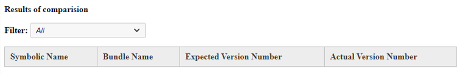

# Experience Manager - How to validate OSGi bundle version after updates?

## Description {#description}

<b>Environment</b>
Adobe Experience Manager

<b>Issue/Symptoms</b>
How to check the OSGi bundle version after an update to confirm successful installation?

## Resolution {#resolution}

<b>Steps to Resolve</b>
1. Copy / Paste the JSON from <b>*http://aemhost1:port/*system/console/bundles.json</b> to the <b>Actual JSON</b> text field.
2. Select <b>Product Version</b> from the *major version* and *minor version* dropdown menus to autopopulate the <b>Expected JSON</b> field, or copy / paste JSON from another AEM instance to the <b>Expected JSON</b> field (also from <b>*http://aemhost2:port/*system/console/bundles.json</b>).
3. Click <b>Compare</b> to view the diff.    
    

<b>Results of Comparison</b>

1. *Similar* bundles are displayed in white, *Differing* bundle versions are displayed in yellow, *Newly added* bundles are displayed in aqua, and *Deleted* bundles in light red.
2. Filter the data using the <b>Filter</b> box.    
    

\* Thanks to [Sham Sundar Hassan Chikkegowda](https://www.linkedin.com/in/sham-sundar-hassan-chikkegowda-6b03a517) for providing the original [source code](https://github.com/Schikkeg/schikkeg.github.io/blob/master/tools/coi.html) for this tool. His personal site can be visited [here](https://www.aemstuff.com/).
