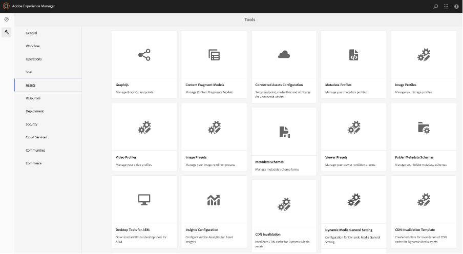

# Changing Dynamic Media URL for DM Assets

The article explains how to change the Dynamic Media URL for DM assets.

## Description {#description}

### Environment

- Experience Manager Assets
- Experience Manager 6.5

### Issue/Symptoms

On your Adobe Experience Manager (AEM) Author Instance (version 6.5.11 and above), you can use the General Settings section to configure DM Server settings and change Publish Server URL or Dynamic Media URL for your DM assets.

To open Dynamic Media General Settings page, on your AEM Author Instance, click on <b>Tools</b>, then go to <b>Assets</b>, then go to <b>Dynamic Media General Setting</b>.

Make sure you have configured Dynamic Media on your AEM Author Instance. Click on <b>Tools</b>, then go to<b> Cloud Services</b> then go to <b>Dynamic Media Configuration</b>.

Published Server Name is Content Deliver Network (CDN) server used in all system-generated URL calls specific to your Dynamic Media account.

Make sure your custom domain name is either mapped to Adobe’s Content Distribution Network (CDN) Server or in case you are using your own CDN Provider’s domain name, it should be mapped to our Origin Server\*

\*Please contact Adobe Dynamic Media Support for more information.

## Resolution {#resolution}

Once you have changed the Published Server Name, please save your changes. Do not change <b>Origin Server Name</b> unless instructed to do so by an Adobe Dynamic Media support technician.

 Instructions to change Published Server Name for existing Dynamic Media components on your Sites pages:

- Install the attached package, to create Publish Server URLs node
- Once the package is installed, you will notice 2 files are created on your AEM Author

    - [/libs/dam/gui/content/s7dam/updatepublishserverurl](http://vgaur-wx-1:4502/crx/de/index.jsp#/crx.default/jcr%3aroot/libs/dam/gui/content/s7dam/updatepublishserverurl "View path in CRXDE Lite")
    - [/libs/dam/gui/components/s7dam/updatepublishserverurl/updatepublishserverurl.js](http://vgaur-wx-1:4502/crx/de/index.jsp#/crx.default/jcr%3aroot/libs/dam/gui/components/s7dam/updatepublishserverurl/updatepublishserverurl.jsp "View path in CRXDE Lite")p

.         

- ​​​​​​​Enter your AEM Sites path on the “path” parameter on this URL : http://`<` aem-server`>` :portnumber/libs/dam/gui/content/s7dam/updatepublishserverurl.html?path=/content/mysite&update=true​​​​​​​
- Serving that URL will automatically update the DM URLs for all the Dynamic Media component on all the Sites pages on your mentioned AEM Sites path and show this type of output

 All the Dynamic Media component URLs will be changed to the new Published Server Name for your AEM Site.
 This a view of DM component, using old Published Server Name
 
 This is view of DM Component, Published Server name changes after hitting this URL : http://`<` aem-server`>` :portnumber/libs/dam/gui/content/s7dam/updatepublishserverurl.html?path=/content/mysite&update=true
 
 Note: To get a list of all the Dynamic Media component on your AEM Sites path, you may call this URL : <u style="text-decoration:underline">http://`<` aem-server`>` :portnumber/libs/dam/gui/content/s7dam/updatepublishserverurl.html?path=/content/mysite</u>

 ​​​​​​​
