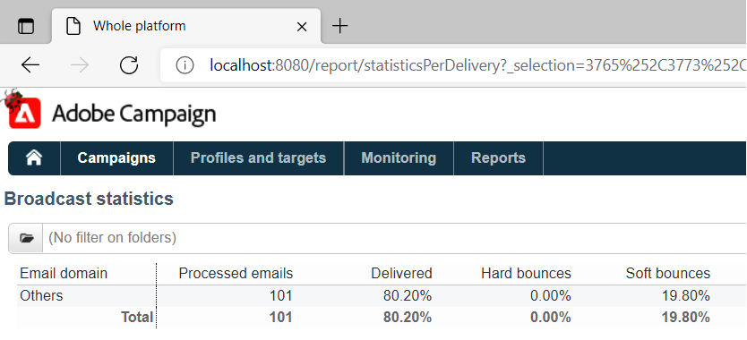

# Delivery Reports unable to aggregate stats in ACC due to IE limitation

## Description {#description}

<b>Environment</b><br>Campaign Classic<br>

<b>Issue/Symptoms</b>
The issue is related to the maximum URL length in Internet Explorer, which is 2048 characters: [details](https://support.microsoft.com/en-us/topic/maximum-url-length-is-2-083-characters-in-internet-explorer-174e7c8a-6666-f4e0-6fd6-908b53c12246).

The HTML source of the page displays reports within the ACC client.

The URLs within the href attributes of the a tags are good, i.e., they are not truncated. However, if a URL is copied and pasted within IE, it will truncate the link to 2048 characters and will not be able to open it:


The same will happen when right-clicking on the report within the ACC client and selecting *"Open in new window."* This will open up IE automatically, but the address bar will be empty. If fewer deliveries are selected, and the steps are repeated, IE will open with the correct URL.

Currently, there is an ongoing effort to replace IE with Edge. Edge is based on Chromium and does not have these URL restrictions. This has been confirmed by copying/pasting the long URL into Edge, which does not truncate the URL and opens the report without any issues:




## Resolution {#resolution}


This issue should be automatically resolved once the transition from IE to Edge is finished. Until then, the following workaround can be deployed:

- Copy the URL to the report from the ACC client by right-clicking on the report and selecting *the Copy shortcut*. This should copy the entire URL into the clipboard.
- The URL needs to be modified slightly to be able to open in other browsers. The URL copied from the client will follow this pattern:


```
javascript:switchToReportView(%22statisticsPerDelivery%22,%20%22/report/statisticsPerDelivery?_selection=3765%252C37...
```


- The part of the URL starting from `/report/` needs to be copied and appended to the address of the instance. E.g. (in this case, the address is localhost):


```
http://localhost:8080/report/statisticsPerDelivery?_selection=3765%252C3773%252C3781%252C3789%252C3793%252C3769%...
```


- Copy the resulting URL into another browser - Edge, Firefox, or Chrome should all work fine.
