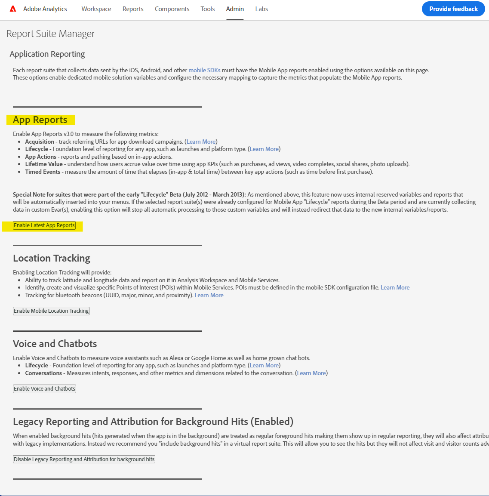

# Enable/activate classification for Mobile App dimensions

## Description {#description}

### <b>Environment</b>

- Customer Journey Analytics
- Analytics

### <b>Issues/Symptoms</b>

Generally while accessing Mobile Classifications under Report Suite Manager -`>`  App Management -`>`  App Classification may show the message mentioned below-

Mobile Classifications: '*This feature has not been enabled for this report suite. Please contact your customer support representative to enable it.*' (see below).

To enable classification for mobile app dimensions, user will first need to enable "App Reporting" for that report suite.

## Resolution {#resolution}

<b>Pre-requisites</b>: Product Administrator rights.  <b>Enable App reporting by following the steps given below:</b>
- Go to Analytics - Admin - Report suite and select the desired report suite. Go to Edit Settings - App Management -<b> </b>App Reporting in Report Suite Manager.
- Click on ‘<b>*Enable Latest App Reports</b>*.’ Based on your requirements, you can also enable others.

     
 
- A confirmation ping pops up after it is enabled.

After some time, re-login to the Adobe Analytics, and Mobile App Classification page will be available (Edit Settings - App Management - App Classifications).

For more information about App Management please click [here](https://experienceleague.adobe.com/docs/analytics/admin/admin-tools/manage-report-suites/edit-report-suite/app-management/app-reporting.html).
