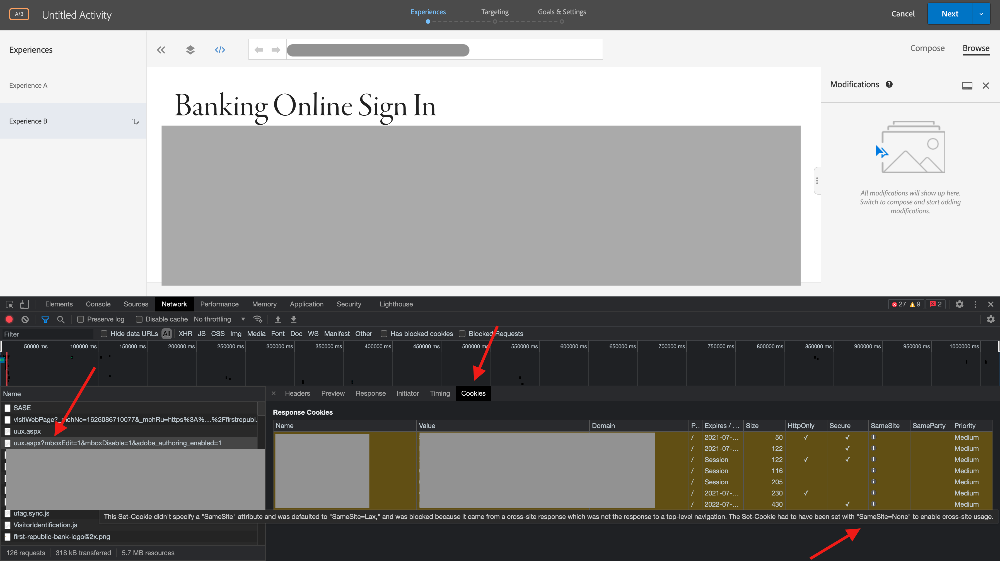

# Adobe Target EEC Troubleshooting

Detailed guide on Adobe Target EEC Troubleshooting by allowlisting the IP addresses listed below. (Contact the IT team to allowlist the following IP addresses)

## Description {#description}

<b>Environment</b>
Adobe Target

### Issues/Symptoms

<b>Common EEC-related issues</b>
1. The EEC won’t load an internal QA URL that is not accessible on public IP.
2. Seeing timeouts or “*access denied*” errors when loading sites with proxy enabled. (EEC only)
3. Website domain blocking the EEC.

## Resolution {#resolution}

<b>Issue: </b>Your website domain (ISP) is blocking the Enhanced Experience Composer.

<b>Solution:</b> Allowlist the IP addresses listed below (Ask your IT team to allowlist the following IP addresses):

- 99.80.139.221
- 54.78.56.224
- 54.247.179.246
- 54.80.219.243
- 34.201.235.54
- 54.196.224.236
- 35.75.212.45
- 52.199.184.130
- 18.180.161.176

Turn off the <b>Enhanced Experience Composer</b> in the <b>Configure</b> `>` <b> Page Delivery menu.</b>

<b>Issue:</b> You see timeouts or “access denied” errors when loading sites with proxy enabled. (EEC only)

<b>Solution: </b>Make sure proxy IPs are not blocked in your environment.

<b>Issue: </b>The EEC won’t load on secure pages on my site that use TLS 1.0. (EEC only)

<b>Solution: </b>You might see the error message described above in “The Enhanced Visual Experience Composer won’t load on secure pages on my site.” if the above IP addresses are allotted to you but your website does not support TLS version 1.2.

Target currently uses the default configuration of 1.2. Prior to the Target 18.4.1 (April 25, 2018), the default configuration supported TLS 1.0.

How to check which TLS version your browser uses
1. Open the affected website in Chrome.
2. From the Chrome menu (the three vertical ellipses), click More Tools `>`  Developer Tools.

3. Open the Security tab, then examine the TLS version information under Connection

