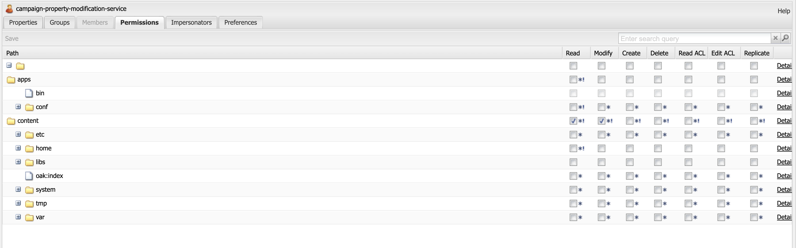

# AEM Email Templates not getting synced with Adobe Campaign.

## Description {#description}

<b>Environment</b>

- Adobe Experience Manager

<b>Issue/Symptoms</b>

When a user tries to copy and paste the site's template on which the Campaign approval workflow is already executed, the cq:acLinks and cq:acUUID properties for Adobe Campaign are not removed.

Due to this, the Adobe campaign is not able to sync the Email template from AEM and gives up an error: Duplicate acUUID found as cq:acLinks and cq:acUUID properties are unique properties.

<b>Steps to Reproduce:</b>

1: Create a Site’s Email Template in AEM.
 2: Run Campaign Approval workflow.
 3: Approve the template by completing the workflow steps.
 4: Navigate to crx/de.
 5: The copy/pasted template will contain cq:acLinks and cq:acUUID properties.

<b>Errors in the Logs:</b>

No related errors can be found in the error logs.

<b>Properties of Template in crx/de after Copy-paste operation:</b>

<b>Experienced </b><b>Behavior:</b>

<b>Expected </b><b>Behavior</b><b>:</b>

## Resolution {#resolution}

The campaign-property-modification-service is a service user which is used for modifying properties of campaign newsletter on copy and paste function.
This usercampaign-property-modification-service should have read and modify permissions on the content folder.

If it doesn’t have read and modify permissions on the content folder, it can’t clean up the cq:acLinks and cq:acUUID properties of the copy-pasted site template.

After providing the user necessary permissions, the properties get cleaned up.

<b>Screenshot of User Permissions:</b>

