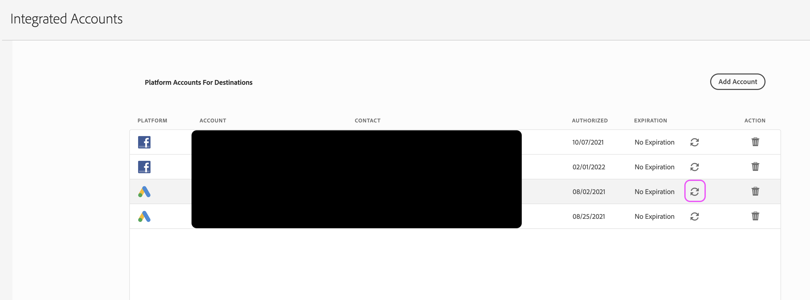

# How to refresh integrated account credentials?

## Description {#description}

<b>Environment</b>

Adobe Audience Manager

<b>Issue/Symptoms</b>

How to map segments to a destination associated with an integrated account (such as Facebook, Twitter, or LinkedIn)?

## Resolution {#resolution}

You'll need access to the AAM UI and credentials for your associated integrated account to complete these steps.

1. Navigate to Admin » Integrated accounts page in the AAM UI, and locate the account.
2. Click the circular "refresh" button to the far right of the account in question:

    

    

3. Depending on the account type, you'll be brought to the associated platform to complete the refresh workflow. Input your credentials for the account and complete any additional steps as prompted.

If you encounter errors, attempt the process one more time after clearing your cookies/cache or utilizing a new incognito browser. We also advise utilizing Chrome over other browsers to complete this process.
