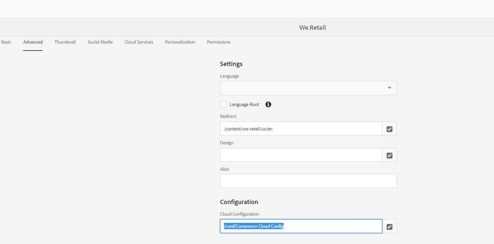

# AEM CIF integration issue. Products are not loading in CIF core component dialog.

Make sure to configure the Commerce cloud config in "Cloud Configuration" field under the Advanced tab in Page Properties.

## Description {#description}

### Environment

Adobe Experience Manager (AEM)

Adobe Commerce on cloud infrastructure

### Issue

Products are not loading in CIF core components dialog.

As per documentation [Getting started with AEM Content and Commerce](https://experienceleague.adobe.com/docs/experience-manager-65/commerce/storefront/getting-started.html), Adobe Commerce on cloud infrastructure configs configured in AEM with Catalog Root Category Identifier as "*4*" instead of "*2*" (which is default value) in CIF cloud config dialog.

But when checked the request from AEM to Adobe Commerce Instance its showing <b>CategoryId</b> as "*2*" (default value) instead of "*4*" due to which products are not loading in CIF core components dialog.

## Resolution {#resolution}

This issue might occur if the Commerce cloud config is not set on the Page Properties under the Advanced tab.

Usually you should set this Commerce cloud config on the site root page or landing page level in the content tree.

In order to fix this issue, make sure to configure the Commerce cloud config in "Cloud Configuration" field under the Advanced tab in page properties as shown in the screenshot below.

