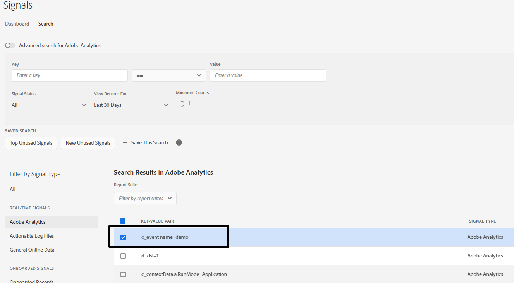

# Error while creating new trait from Signals Dashboard

### Environment

Audience Manager

### Issue/Symptoms

Learn how to create a new traits from signals present in Signals Dashboard by selecting the correct signal condition.

## Description {#description}

While creating a new traits from signals present in Signals Dashboard, I am getting below error:

Signal that I am trying to use is:

## Resolution {#resolution}

The given error states that key in the signal can only contain double-quotes ("), dot (.), hyphen (-) and underscore(_).

Upon looking at the signals closely, it was identified that it contains one space as highlighted below due to which trait validation was failing.

Selecting correct signal condition is really important.

References:

Trait Rules- [https://experienceleague.adobe.com/docs/audience-manager/user-guide/features/traits/trait-builder/manage-trait-rules.html?lang=en](https://experienceleague.adobe.com/docs/audience-manager/user-guide/features/traits/trait-builder/manage-trait-rules.html?lang=en)

Name Requirements - [https://experienceleague.adobe.com/docs/audience-manager/user-guide/features/traits/trait-key-name-requirements.html?lang=en](https://experienceleague.adobe.com/docs/audience-manager/user-guide/features/traits/trait-key-name-requirements.html?lang=en)
