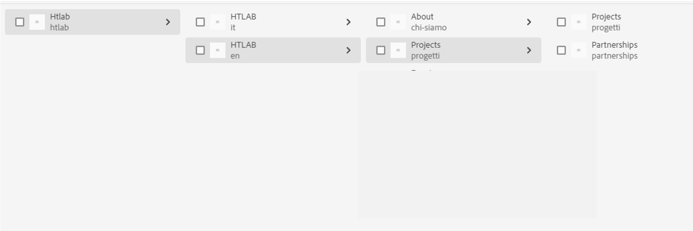

# Wrong content displayed on published page

## Description {#description}

One customer was facing the following issue:
 Their site had two language branches – Italian (it) and English (en)- with the same content, the English branch being a live copy of the Italian one.
 

 
 The English “*projects*” page had the name "*progetti*" but it also had an alias set to “*projects*” therefore it should have been accessible at both http://`<` Publisher`>` .`<` URL`>` /content/htlab/en/progetti.html and http://`<` Publisher`>` .`<` URL`>` /content/htlab/en/projects.html.
 However, only when accessed via “*progetti*” the correct children were displayed as accessible links inside the page – "*projects*" and "*partnerships*".
 
 Whenever it was accessed via “*projects*” the children displayed were "*projects*" and an incorrect page “*partenerships*” although that page was not present in the author.

## Resolution {#resolution}

It was found that in the publisher’s repository besides the correct “*progetti*” page there was also a page named “*projects*” which contains the wrong page “*partenerships*” as a child. 
Perhaps at some point, it was created and then deleted without it being published and it was also cached.
The issue was fixed after deleting the whole “*Projects*” page under en and following the steps:

1. Create a live copy of the Italian "*progetti*" page without including its children and with the properties: Name: projects; title: Projects 
2. Create live copies for the children of the "*progetti*" page like below: 
             - for “*progetti*”, create a live copy with the Name "projects" and title "Projects" 
             - for “*partnerships*” create a live copy with the Name "partenership" and title "Partenership"
3. Publish the newly created pages
4. Unpublish the pages
5. Delete the whole "p*rojects*" page again.

This way, the “*projects*” page was also deleted from the publisher’s repository together with the incorrect “*partenerships*” one.
