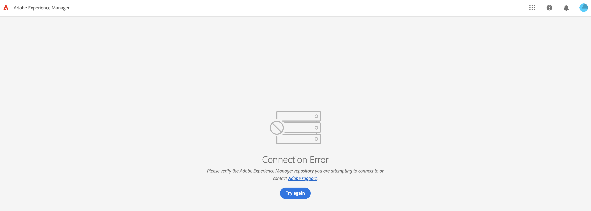

# Adobe Experience Manager: Content Fragments Console accessing issue


After you update the externalizer configuration to the correct author URL, the Content Fragments Console is accessible.

## Description {#description}


<b>Environment</b>

Adobe Experience Manager (AEM)

<b>Issue</b>

When attempting to access the Content Fragments Console from the top level of the Global Navigation, an error screen is displayed:

*Connection Error
<br>Please verify the Adobe Experience Manager repository you are attempting to connect to or contact Adobe support.*





## Resolution {#resolution}


The issue can have two different and unrelated root causes:

<b><u>Cause #1</u>:</b>

The issue could be caused by having a custom CORS config in the environment:

Customer configuration:


```
{
"supportscredentials":true,
"supportedmethods":[ 
"GET",
"HEAD",
"POST"
] ,
"maxage:Integer":86400,
"alloworigin":[ 
"*"
] ,
"supportedheaders":[ 
"*"
] ,
"allowedpaths":[ 
".*"
] 
}
```


After removing the configuration, the Content Fragments Console was accessible.


<b><u>Cause #2</u>:</b>

The second root cause for the same issue was due to the OSGi configuration of the Day CQ Link Externalizer which was changing the Content Fragments Console URL as per the example URLs below:

- from [https://experience.adobe.com/?repo=author-pxxxxx-eyyyyyy.adobeaemcloud.com#/@customer_name/aem/cf/admin/](https://experience.adobe.com/?repo=author-pxxxxx-eyyyyyy.adobeaemcloud.com#/@customer_name/aem/cf/admin/)
- to [https://experience.adobe.com/?repo=author-environment.com#/@customer_name/aem/cf/admin/](https://experience.adobe.com/?repo=author-environment.com#/@customer_name/aem/cf/admin/)


The Content Fragments Console was accessible after updating the externalizer configuration to the correct author URL.


