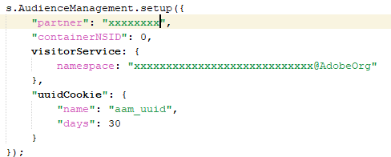

# How to remove Audience Manager Calls

## Description {#description}

### Environment

Audience Manager

### Issues/Symptoms

How to remove all server calls or data flows into Audience Manager?

## Resolution {#resolution}

One can remove Audience Manager Completely by removing its association from these places:

1. Removing DIL code
2. Removing Server-Side Forwarding in Adobe Analytics Library
3. Unpublish all Analytics Segments
4. Stopping Import/Export workflows in Adobe Campaign
5. Stopping Adobe Target calls
6. Stop DCM log Ingestion, 3rd Party pixel calls
7. Stop all your destinations sharing data with any 2nd or 3rd party
8. Stop all offline data ingestions

<b>Removing DIL code</b>

1. In your code, identify following function and remove them:

    1. DIL.create
    2. DILinstance.api.signals().submit()
    3. DIL.modules.siteCatalyst.init `[` If you are forwarding data to Adobe Analytics`]`
    4. GA.submitUniversalAnalytics(); OR GA.submitUniversalAnalytics();  `[` If you are forwarding data to Google Analytics`]`
2. Once you have removed above function, ensure that you have removed DIL JS library from your code as well.

<b>Outcome</b>: Republish and Reload your website, you should NOT see any call as https://subdomain.demdex.net/event?....

<b>Removing Server-Side Forwarding</b>

1. Go into the Analytics report suites which are enabled for Server-Side Forwarding and disable the check box.

 

1. Once above step is done, go into your AppMeasurement.js code and remove code you see below. If you have Launch, then simply deselect Audience Manager forwarding checkbox.

             

<b>Outcome</b>: Analytics call response should be empty.

<b>Unpublish all Analytics Segments</b>
Go into individual Analytics segments which are published and unpublish them.
<b>Outcome</b>: Offline segment share will stop from Analytics to Audience Manager.

<b>Stopping Import/Export workflows in Adobe Campaign</b>
From Audience Manager: Delete all your Campaign destinations
From Campaign: Either delete or stop completely, import/export workflows from Campaign UI.
<b>Outcome</b>: Segments to-n-fro from Audience to Campaign will be stopped.

<b>Stopping Adobe Target calls</b>
Get in touch with your Adobe Account Team, to have “Shared Audiences” or “People Core Services” feature disabled by Provisioning team.
<b>Outcome</b>: Target will not make additional calls to Audience Manager.

<b>Stop DCM log Ingestion, 3rd Party pixel calls</b>
If you have DCM log ingestion enabled, then please have it stopped and do not upload any additional metadata files.
If you have any impression/click/conversions pixel active anywhere, then please have them stopped too.
<b>Outcome</b>: No 3rd party data collection.

<b>Stop all your destinations sharing data with any 2nd or 3rd party</b>
URL and Cookie destinations can be stopped directly from UI.
For S2S destinations, you can reach out to support to stop the destinations completely.
<b>Outcome</b>: No data will be shared out of Audience Manager.

<b>Stop all offline data ingestions</b>
If you are uploading any data files into Audience manager, then please stop them right away.
<b>Outcome</b>: No offline data will be uploaded.
