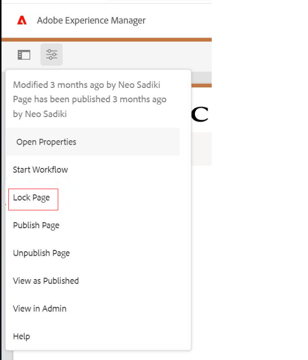
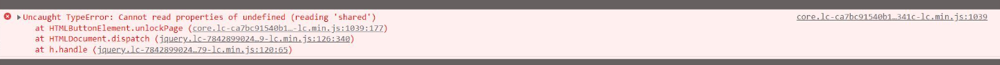

# Page unlock option not working

## Description {#description}

When trying to lock/unlock a page via the page sidebar Image 1 one customer is only able to lock it. When they try to unlock it, they see the error Image 2 and the page cannot be unlocked.  However, they can lock/unlock the page successfully when trying via the site admin console 3.    Image 1      Image 2      Image 3

## Resolution {#resolution}

The error 1 when unsuccessfully trying to unlock a page appears because the page doesn't include the "cq.shared" client lib.

To fix this the customer needs to put a dependency on this clientlibs to have it loaded for their custom content page.

1 core.lc-ca7bc91540b118ca20ea6d0db684341c-lc.min.js:1039

 Uncaught TypeError: Cannot read properties of undefined (reading 'shared')
 at HTMLButtonElement.unlockPage (core.lc-ca7bc91540b118ca20ea6d0db684341c-lc.min.js:1039:177)
 at HTMLDocument.dispatch (jquery.lc-7842899024219bcbdb5e72c946870b79-lc.min.js:126:340)
 at h.handle (jquery.lc-7842899024219bcbdb5e72c946870b79-lc.min.js:120:65)
