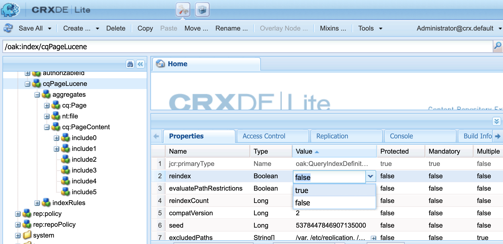

# Adobe Experience Manager: The incoming links don't show all linking pages

## Description {#description}

<b>Environment</b>
- AEM as a Cloud Service
- AEM 6.5


<b>Issues/Symptoms</b>
If a node with a link is located at deeper than 4 levels from its page's jcr:content, 
 the page will not be shown in the incoming links of the link target.

• When a linking page is shown in the incoming links:
   /content/wknd/us/en/link-page/jcr:content
   1) /root
   2) /container
   3) /container
   4) /text(link)

• When a linking page is not shown in the incoming links:
   /content/wknd/us/en/link-page/jcr:content
   1) /root
   2) /container
   3) /container
   4) /container
   5) /text(link)


## Resolution {#resolution}


Check the hierarchy of nodes that contain the link using CRXDE Lite.


Review the structure of the page and adjust it so that the link node can be located at a shallow level.
If the level of the linking node remains at a deep level adjust an index to increase the level to be indexed for the incoming links searching.

Using CRX/DE Lite, select


```
/oak:index/cqPageLucene/aggregates/cq:PageContent.
```

 Create a new node and add a 'path' property that expresses the required hierarchy level.
- In the following example, 'include4' and 'include5' are added to increase the level of incoming links searching up to 6.


To perform reindex, change the value of reindex property of `/oak:index/cqPageLucene` to true and save it.


  
    - Once the reindexing completes, the following message appears in error.log.

`    13.01.2023 12:00:45.264 *INFO* async-index-update-async org.apache.jackrabbit.oak.plugins.index.AsyncIndexUpdate async Reindexing completed for indexes: /oak:index/cqPageLucene*(788) in 733.7 ms (733 ms)`

Reindexing may cause a performance issue.
    It is recommended to schedule the reindex task for a relatively quiet time.
