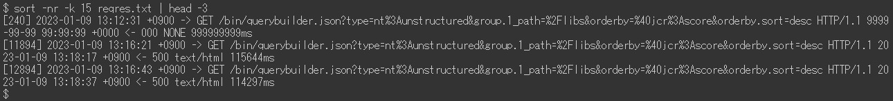

# Examples of request.log analysis | AEM

## Description {#description}

### <b>Environment</b>

Experience Manager 6.5

### <b>Issue/Symptoms</b>

The Adobe Experience Manager (AEM) `request.log` contains various useful information, such as response time, for analyzing the performance issues. Here is a list of analysis examples using Linux commands (including some external commands like ruby `[` 1`]`  and datamash `[` 2`]` ).

<u>Installation guides</u>

`[` 1`]`  [https://www.ruby-lang.org/en/documentation/installation/](https://www.ruby-lang.org/en/documentation/installation/)

`[` 2`]`  [https://www.gnu.org/software/datamash/download/](https://www.gnu.org/software/datamash/download/)

## Resolution {#resolution}

### Table of Contents

<b>A. Introduction</b>

- Format of `request.log`

<b>B. Preparation Steps</b>

1. Data cleansing
2. Restarted time
3. Number of accesses per hour
4. Maximum concurrent processing
5. Split a log file
6. Merge request records and response records

<b>C. Examples of Analysis</b>

1. The heaviest accesses
2. Accesses missing response
3. Slow accesses
4. Time-series data of response time
5. Minimum, mean (average), median, maximum response time
6. Number of accesses per a period
7. Number of response statuses per a period
8. Most frequent URLs
9. `access.log` records for a `request.log` record

<b>D. Conclusion</b>

#### <b>A. Introduction</b>

<u>The format of request.log</u>:

AEM 6.5 generates `request.log` in the following format by default. Due to a system limitation, the command lines in this article are shown as images instead of plain text.

Example of `request.log`:

In this article, a line with "-`>` " is referred as a "request record." A line with "`<` -" is a "response record."

<u>Request Record</u>:

When a request is received by AEM, a request record is logged. It contains the date and time of receipt, the request ID, the request method, and the URL.

<u>Response Record</u>:

When AEM responds to a request, a response record is logged. It contains the date and time of response, the request ID, the status code, Content-Type, and the response time (in milliseconds).

Find the corresponding manual on [Interpreting the request.log](https://experienceleague.adobe.com/docs/experience-manager-65/deploying/configuring/monitoring-and-maintaining.html#interpreting-the-request-log).

#### <b>B. Preparation Steps</b>

<u>Step 1. Data cleansing</u>

Before diving into the analysis of `request.log`, it is important to standardize the log records.

The first `sed` command removes an extra space in Content-Type of response records, to prevent wrong field separation with white space. The ruby command (see <b>`[` 1`]` </b> above to install Ruby) converts the date format to ISO 8601. The ruby command also separates date and time with white space instead of a colon.

<u>Step 2. Restarted time</u>

Restarting AEM and a service pack installation resets the request ID of `request.log`. The request records with request `ID = 0` indicates there might be these kinds of operation.

In the above example, request IDs were reset to 0 at 13:08:49 and 13:26:13.

<u>Step 3. Number of accesses per hour</u>

Count the number of accesses per hour and the time range of the `request.log`.

<u>Step 4. Maximum concurrent processing</u>

The number of concurrent processing helps to guess the server load of AEM.

By default, the maximum number of concurrent connections for Jetty in AEM is set to 200. There is a delay in releasing the socket after completing the response. When the number of concurrent processing exceeds approximately 170, it becomes unable to accept new requests.

<u>Step 5. Split a log file</u>

The request ID of `request.log` is reset when AEM restarts or a Service Pack is installed. Due to this behavior, the analysis may be incorrect when a `request.log` contains such operations. To perform accurate analysis and to reduce the file size being handled at once, split the `request.log` using request records with the request `ID = 0`.

<u>Step 6. Merge request records and response records</u>

Merging request and response records by request ID makes it easier to spot when performance issues started. This merged log file will be used in the later examples.

The last `sed` command adds a dummy response to request records that do not have a corresponding response record. There may also be response records without request records. But they are ignorable as they are typically not an issue for investigation.

The merged log file should look like this:

#### <b>C. Examples of analysis</b>

<u>Example 1. The heaviest accesses</u>

Sort the merged log file by response time in descending order, including accesses without response.

<u>Example 2. Accesses missing response</u>

Extract accesses missing their corresponding response records using the dummy response time.

If the timing of receiving accesses without response is correlated with an increase in server load, these accesses may have triggered performance issues.

<u>Example 3. Slow accesses</u>

Extract accesses that took more than 10 seconds.

When the number of hits is too high, replace `[ 0-9] {5}` with `[ 0-9] {6}` in the `grep` command to narrow down to accesses that took more than 100 seconds.

<u>Example 4. Time-series data of response time</u>

Extracting only the timestamp and response time from the data is useful to create graphs.

Omitting accesses that responded immediately makes the data more efficient. The following example extracts access that took more than one second.

<u>Example 5. Minimum, mean (average), median, maximum response time</u>

The above example uses datamash command (https://www.gnu.org/software/datamash/) for statistical processing. If the log contains accesses without response, the dummy value will influence the result.

<u>Example 6. Number of accesses per a period</u>

Count the number of accesses per ten minutes. The result helps to determine if large traffic caused a performance issue.

The following example narrows the data down to only POST requests. A typical use case is to determine if there is a concentration of content authoring or replication to the Publish tier.

<u>Example 7. Number of response statuses per a period</u>

Create a table of the number of each response status per ten minutes with datamash command.

<u>Example 8. Most frequent URLs</u>

Print the top three URLs which were accessed most frequently per ten minutes.

<u>Example 9. access.log records for a request.log record</u>

Search `access.log` for records that correspond to a particular request ID.

If multiple accesses to the same URL at the same time happened, the result shows multiple `access.log` records for a single request ID.

#### <b>D. Conclusion</b>

The examples in this article should help you analyze your performance issues.

The examples listed have been tested on CentOS 7.5 and Ubuntu 22.04LTS, but they may not work as expected depending on your environment, such as different versions or variations of the commands. Please adjust them accordingly to the commands installed in your environment.
