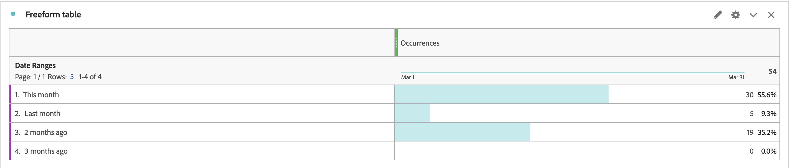

# How to manually sort the Date Range Dimension order in Workspace report

This article addresses sorting issues with Date Range Dimensions in Adobe Analytics Customer Journey Analytics. The workaround involves using the "Table Builder" feature to manually reorder the dimensions, allowing for custom sorting such as "This Month" `>`  "Last Month" `>`  "2 months ago" `>`  "3 months ago".

## Description {#description}

<b>Environment</b>
 Adobe Analytics
 Customer Journey Analytics

<b>Issue</b>
 You want to sort the Date Range Dimensions in the order of  "This Month" » "Last Month"  » "2 months ago" » "3 months ago".

However, by clicking the sorting icon, it shows in different order.
   How can you manually sort the Dimension order?  
            

## Resolution {#resolution}

You can manually order the Dimensions with  the "Table Builder" feature.

Open Freeform Table, then click the "Enable table builder" button.

Drop Dimensions to the table in order you want and click the Build button

Now the Dimensions are sorted in the order you set  "This Month"  »  "Last Month"  » "2 months ago" » "3 months ago"

