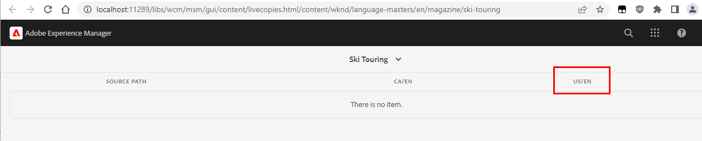

# References not updated during rollout for inner Live Copy

## Description {#description}

<b>Environment</b>
- Experience Manager as a Cloud Service
- Experience Manager 6.5
- Experience Manager

<b>Issue/Symptoms</b>
When creating some nested/inner Live copies, the references in the content of the page will not be updated to their live-copy equivalent during the Rollout (they will instead reference the Blueprint path).

An inner Live Copy can be created due to multiple reasons:

- either by creating them manually ("Create  Live Copy")
- or by editing the "Live Copy" properties of a sub-page from a Live Copy root

For example, considering the WKND sample website, having the following BluePrint/LiveCopy structure:

- <b>Blueprint:</b> /content/wknd/language-masters/en
- <b>Live copy:</b> /content/wknd/us/en and /content/wknd/ca/en

Now, if one opens the Page properties for the page "/content/wknd/us/en/magazine/ski-touring" (sub-page within the "/content/wknd/us/en" Live Copy).

Going to the "Live Copy" tab and changing either of the properties ("Live Copy Inheritance", "Inherit Rollout Configs from Parent", ...) will create an inner Live Copy.

This can be seen from the presence/creation of a "cq:LiveSyncConfig" at "/content/wknd/us/en/magazine/ski-touring/jcr:content/cq:LiveSyncConfig".

The Blueprint Live Copy dashboard (go to the BP page properties then go to Blueprint then go to Live Copy Overview) will also change from:

to:

## Resolution {#resolution}

To have references correctly rewritten on the inner Live Copy, it is required to enable a specific configuration for the Multi-Site Manager (MSM) Update Action in order to *Update Reference across nested LiveCopies*.

<b>For more information see the corresponding documentation:</b>

[https://experienceleague.adobe.com/docs/experience-manager-cloud-service/content/sites/administering/reusing-content/msm/live-copy-sync-config.html?lang=en#configuring-synchronization-for-updating-references](https://experienceleague.adobe.com/docs/experience-manager-cloud-service/content/sites/administering/reusing-content/msm/live-copy-sync-config.html?lang=en#configuring-synchronization-for-updating-references)

[https://experienceleague.adobe.com/docs/experience-manager-65/administering/introduction/msm-sync.html?lang=en#configuring-synchronization-for-updating-references](https://experienceleague.adobe.com/docs/experience-manager-65/administering/introduction/msm-sync.html?lang=en#configuring-synchronization-for-updating-references)

Follow these steps to either deploy an Open Service Gateway Initiative (OSGi) configuration file or perform a change from the OSGi Web Console when applicable:

1. Access the <b>Web Console</b> then go to <b>OSGi</b> then go to <b>Configuration</b> [(http://localhost/system/console/configMgr)](http://localhost/system/console/configMgr)

2. Search for the <b>CQ MSM References Update Action</b> (`com.day.cq.wcm.msm.impl.actions.ReferencesUpdateActionFactory`)

3. Activate the checkbox <b>Update Reference across nested LiveCopies</b>
