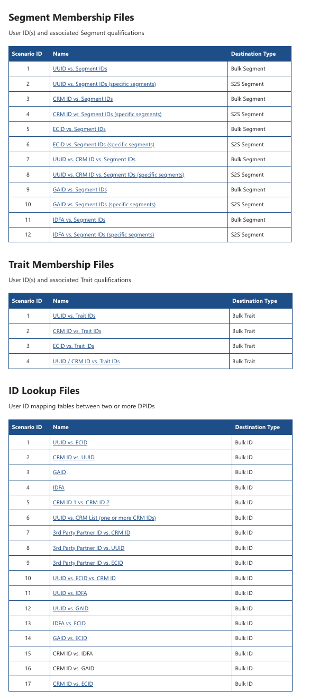

# Bulk Export Options

Learn how to export data from Audience Manager in bulk with these basic export options.

## Description {#description}

<b>Environment </b>

Adobe Audience Manager

<b>Issue/Symptoms</b>

Export data from Audience Manager in bulk with these basic export options. Please open a case with customer care to request configuration of any particular export.

Bulk Export in simple terms means copying data from a SQL server to a data file. This is important to manage and import bulk data smoothly.

## Resolution {#resolution}

