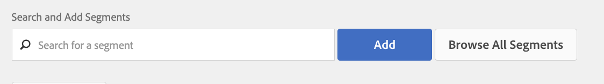

# LiveRamp server-to-server destination

## Description {#description}

<b>Environment</b>

Adobe Audience Manager

<b>Issue/Symptoms</b>

This article offers an overview of the LiveRamp destination within Audience Manager.

<b>Learning Objectives</b>

- ​​​​​​​LiveRamp destination setup process
- Segment activation process

## Resolution {#resolution}

<b>LiveRamp destination setup</b>

If you already have an existing LiveRamp destination, please skip to the segment activation section. 

The LiveRamp destination is a [server-to-server integration](https://experienceleague.adobe.com/docs/audience-manager/user-guide/features/destinations/device-based/device-based-destinations-list.html?lang=en), which means the configuration occurs in the back-end. For the first time destination setup, you will need the assistance of the Audience manager customer care team. Please open a case via the [Admin Console](https://adminconsole.adobe.com/) requesting the creation of a LiveRamp destination. Be sure to include these key details:

- Destination name & description
- LiveRamp client name (alphanumeric value provided by LR representative)
- Segment mapping preference: manual vs auto-fill ID

The segment mapping option will affect the method of delivery to the LiveRamp platform. Please continue reading through the segment activation section for more details.

<b>Segment activation process</b>

Once the customer care team creates the destination, specific audiences/segments can be activated to the LiveRamp destination directly from the UI. First, you must navigate to the destination, and select edit:

You can now identify and add the segment(s) you want to map from this screen:

The mapping value dictates how LiveRamp will represent the audiences within their platform: 

If you choose to configure your destination with auto-fill (which is the default option), then the segment IDs will automatically populate in the mapping field. This means all of your segments will be organized by ID within the LiveRamp platform.

If you choose to manually map segments, you can choose your own friendly names or IDs for the segments when setting the mapping value. The drawback of this is the requirement to manually input these values each and every time you map a segment. This is why the default & preferred method involves the automatic mapping of segment IDs. If you have any questions related to this process,  please open a case with Audience Manager customer care so we can further assist.
