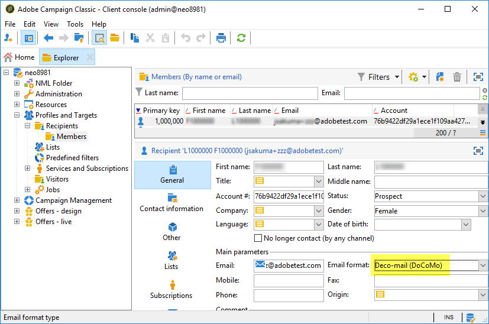

# How to prevent slow email delivery because of Deco-mail recipients?

## Description {#description}

<b>Environment</b>

- Adobe Campaign Classic (ACC)
- Adobe Campaign Standard (ACS)

<b>Issue/Symptoms</b>

An email-channel delivery can be very slow if the target population includes recipients with the <b>Deco-mail</b> email formats.

A recipient has a <b>Deco-mail</b> email format under either or both of the following cases:

1. Its email format is explicitly set to any of the following:
    - Deco-mail (DoCoMo)
    - Decoration Mail (KDDI AU)
    - Decore Mail (Softbank)         
2. Its email domain is configured as `Image inclusion=yes`in:
    - <b>Campaign Management</b> › <b>Non-deliverables Management</b> › <b>Message format management</b>        

## Resolution {#resolution}

To prevent this slow delivery, try the following:

- Cleanse the target population so that it includes no Deco-mail recipient.
- Design the containing workflow so that it excludes Deco-mail recipients from the target population.
- Turn off <b>Analysis for the automatic integration of images</b>.

    
    

<b>Cause</b>

If the recipient has a Deco-mail email format, Campaign applies the typology rule - <b>Analysis for the automatic integration of images</b>. It turns image links in the email to the Deco-mail recipient into attachment image files. The total delivery size could grow quite huge and the throughput could slow down significantly.
