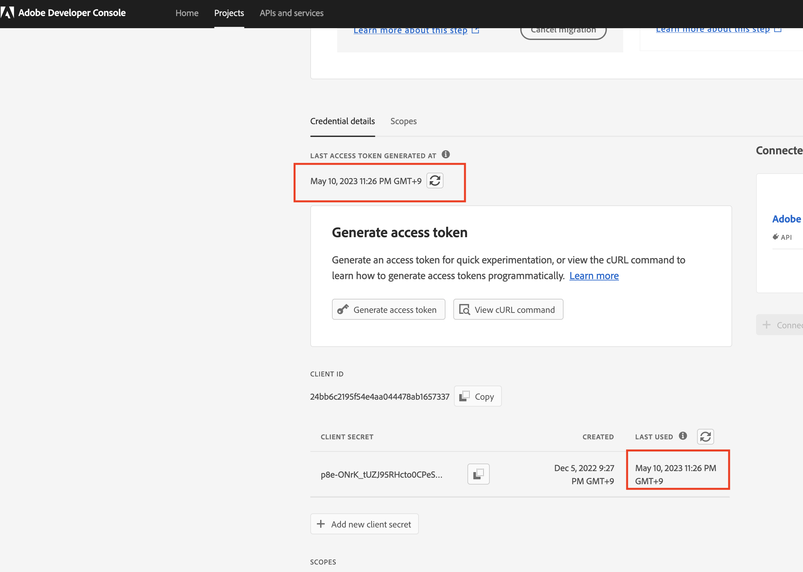

# Steps to Migrate Credentials from JWT to OAuth Server-to-Server

## Description {#description}

### Environment

- Analytics
- Audience Manager

### Issue/Symptoms

The Service Account (JWT) credential has been deprecated in favor of the new OAuth Server-to-Server credential. The new credential makes it easier for you to develop and maintain Adobe applications. It also removes the need to rotate certificates periodically and works out-of-the-box using standard OAuth2 libraries. 

<b>Note: None of your running Adobe applications or integrations will break until Jan 1, 2025.</b>
        <b></b>       

## Resolution {#resolution}

1. Log in to the [Adobe Developer Console](https://auth.services.adobe.com/en_US/index.html?callback=https%3A%2F%2Fims-na1.adobelogin.com%2Fims%2Fadobeid%2FUDPWeb1%2FAdobeID%2Ftoken%3Fredirect_uri%3Dhttps%253A%252F%252Fdeveloper.adobe.com%252Fconsole%2523old_hash%253D%2526from_ims%253Dtrue%253Fclient_id%253DUDPWeb1%2526api%253Dauthorize%2526scope%253DAdobeID%252Copenid%252Cadobeio_api%252Cgnav%252Cread_organizations%252Cadditional_info.projectedProductContext%252Cunified_dev_portal%252Cadditional_info.roles%252Cread_pc.dma_bullseye%252Csession%252Cadobeio.appregistry.read%252Cadobeio.appregistry.write%252Ctest-users.read%252Ctest-users.write%252Cclient.read%252Cdevconsole.email_alerts%252Cservice_principals.write%252Cservice_principals.read%252Cmanage_client_secrets%252Cclient.manage.ui%252Cread_client_secret%26state%3D%257B%2522jslibver%2522%253A%2522v2-v0.38.0-17-g633319d%2522%252C%2522nonce%2522%253A%25228935785551777687%2522%257D%26code_challenge_method%3Dplain%26use_ms_for_expiry%3Dtrue&amp;client_id=UDPWeb1&amp;scope=AdobeID%2Copenid%2Cadobeio_api%2Cgnav%2Cread_organizations%2Cadditional_info.projectedProductContext%2Cunified_dev_portal%2Cadditional_info.roles%2Cread_pc.dma_bullseye%2Csession%2Cadobeio.appregistry.read%2Cadobeio.appregistry.write%2Ctest-users.read%2Ctest-users.write%2Cclient.read%2Cdevconsole.email_alerts%2Cservice_principals.write%2Cservice_principals.read%2Cmanage_client_secrets%2Cclient.manage.ui%2Cread_client_secret&amp;denied_callback=https%3A%2F%2Fims-na1.adobelogin.com%2Fims%2Fdenied%2FUDPWeb1%3Fredirect_uri%3Dhttps%253A%252F%252Fdeveloper.adobe.com%252Fconsole%2523old_hash%253D%2526from_ims%253Dtrue%253Fclient_id%253DUDPWeb1%2526api%253Dauthorize%2526scope%253DAdobeID%252Copenid%252Cadobeio_api%252Cgnav%252Cread_organizations%252Cadditional_info.projectedProductContext%252Cunified_dev_portal%252Cadditional_info.roles%252Cread_pc.dma_bullseye%252Csession%252Cadobeio.appregistry.read%252Cadobeio.appregistry.write%252Ctest-users.read%252Ctest-users.write%252Cclient.read%252Cdevconsole.email_alerts%252Cservice_principals.write%252Cservice_principals.read%252Cmanage_client_secrets%252Cclient.manage.ui%252Cread_client_secret%26response_type%3Dtoken%26state%3D%257B%2522jslibver%2522%253A%2522v2-v0.38.0-17-g633319d%2522%252C%2522nonce%2522%253A%25228935785551777687%2522%257D&amp;state=%7B%22jslibver%22%3A%22v2-v0.38.0-17-g633319d%22%2C%22nonce%22%3A%228935785551777687%22%7D&amp;relay=52c8fdbc-86a5-4f44-9007-22c9bfd518eb&amp;locale=en_US&amp;flow_type=token&amp;idp_flow_type=login&amp;s_p=google%2Cfacebook%2Capple&amp;response_type=token#/).
2. From the filtering menu on the left side, select the option <b>Has Service Account (JWT) credential. </b>

    This way display all the projects that have a Service Account (JWT) credential.

3. Click the <b>Add new credential</b> button to start migration.

4.  The new credential <b>OAuth Server-to-Server</b> has been added to the left side.

- Click <b>Cancel Migration </b>if you need to cancel the migration.
- Click the <b>Review and Delete </b>button after verifying that the new credential <b>OAuth Server-to-Server</b> is working correctly, and when you want to delete the JWT credential to complete the migration.

5. Update customer application code with OAuth2.0 library to generate access token with the new credential.

- [PassportJS](https://github.com/jaredhanson/passport) (Node.js)
- [Spring Security](https://spring.io/projects/spring-security) (Java)
- [Authlib](https://github.com/lepture/authlib) (Python)
- View more libraries at  [https://oauth.net/code/](https://oauth.net/code/)

6. Review the timestamp of the Last Access or Last Used menu to verify customer application generated access tokens using the new credential.

7. Once sure that you have replaced the old credential successfully, move to last step of deleting the old credential.

8. Now, only the new credential for OAuth Server-to-Server remains on the left side, when migration is complete.

 
 
<b>Reference Documents</b>
To ensure your application continues to work after Jan 1, 2025, you must migrate it to use the new OAuth Server-to-Server credentials. The migration process is simple and enables a zero-downtime migration. To learn more, view our documentation 
1. [Migrating from Service Account (JWT) credentials](https://nam04.safelinks.protection.outlook.com/?url=https%3A%2F%2Fpostoffice.adobe.com%2Fpo-server%2Flink%2Fredirect%3Ftarget%3DeyJhbGciOiJIUzUxMiJ9.eyJ0ZW1wbGF0ZSI6ImJsZXRoZXJfbm90aWNlX29hdXRoX3NlcnZlcl90b19zZXJ2ZXIiLCJlbWFpbEFkZHJlc3MiOiJndXd1K3NvbmVAYWRvYmV0ZXN0LmNvbSIsInJlcXVlc3RJZCI6IjM0ZjIyNTMwLThjMzEtNDlkNC1iZjEyLThlZGIyY2E0ODdhOCIsImxpbmsiOiJodHRwczovL3d3dy5hZG9iZS5jb20vZ28vZGV2c19zMnNfbWlncmF0aW9uX2d1aWRlIiwibGFiZWwiOiI5IiwibG9jYWxlIjoiZW5fVVMifQ.Pr8LjAW5wq_tEqCQLs4Y2fwJSTW_Z2FH0CIVInolEKvySfPDiF7vl8Hg4S9ne_V6a74oLfCVzc99EE9K4XUoBQ&amp;data=05%7C01%7Cguwu%40adobe.com%7C3b1b2261ea264d45d9df08db4ce8a7de%7Cfa7b1b5a7b34438794aed2c178decee1%7C0%7C0%7C638188334359675040%7CUnknown%7CTWFpbGZsb3d8eyJWIjoiMC4wLjAwMDAiLCJQIjoiV2luMzIiLCJBTiI6Ik1haWwiLCJXVCI6Mn0%3D%7C3000%7C%7C%7C&amp;sdata=dd8x%2FoDHh0QUi3xboxa78uA54JXEaVq5qYkP8zkvymk%3D&amp;reserved=0)
2. [Using the new Oauth Server-to-Server credentials](https://nam04.safelinks.protection.outlook.com/?url=https%3A%2F%2Fpostoffice.adobe.com%2Fpo-server%2Flink%2Fredirect%3Ftarget%3DeyJhbGciOiJIUzUxMiJ9.eyJ0ZW1wbGF0ZSI6ImJsZXRoZXJfbm90aWNlX29hdXRoX3NlcnZlcl90b19zZXJ2ZXIiLCJlbWFpbEFkZHJlc3MiOiJndXd1K3NvbmVAYWRvYmV0ZXN0LmNvbSIsInJlcXVlc3RJZCI6IjM0ZjIyNTMwLThjMzEtNDlkNC1iZjEyLThlZGIyY2E0ODdhOCIsImxpbmsiOiJodHRwczovL3d3dy5hZG9iZS5jb20vZ28vZGV2c19zMnNfY3JlZGVudGlhbF9vdmVydmlldyIsImxhYmVsIjoiMTAiLCJsb2NhbGUiOiJlbl9VUyJ9.c-c4--RAgDvS0l-WI5yIuYBIbzL7OeWXepCCfSzR1AkdVnrTZmWmm7jYmu11JqHZ_UBPANJqYEzEZrtydXY0YQ&amp;data=05%7C01%7Cguwu%40adobe.com%7C3b1b2261ea264d45d9df08db4ce8a7de%7Cfa7b1b5a7b34438794aed2c178decee1%7C0%7C0%7C638188334359675040%7CUnknown%7CTWFpbGZsb3d8eyJWIjoiMC4wLjAwMDAiLCJQIjoiV2luMzIiLCJBTiI6Ik1haWwiLCJXVCI6Mn0%3D%7C3000%7C%7C%7C&amp;sdata=YwiTIXMxPv9MhhEhVR3sv0g%2Bqi4NP8OERnJxE9C65I0%3D&amp;reserved=0)
3. [FAQs](https://nam04.safelinks.protection.outlook.com/?url=https%3A%2F%2Fpostoffice.adobe.com%2Fpo-server%2Flink%2Fredirect%3Ftarget%3DeyJhbGciOiJIUzUxMiJ9.eyJ0ZW1wbGF0ZSI6ImJsZXRoZXJfbm90aWNlX29hdXRoX3NlcnZlcl90b19zZXJ2ZXIiLCJlbWFpbEFkZHJlc3MiOiJndXd1K3NvbmVAYWRvYmV0ZXN0LmNvbSIsInJlcXVlc3RJZCI6IjM0ZjIyNTMwLThjMzEtNDlkNC1iZjEyLThlZGIyY2E0ODdhOCIsImxpbmsiOiJodHRwczovL3d3dy5hZG9iZS5jb20vZ28vZGV2c19zMnNfbWlncmF0aW9uX2d1aWRlX2ZhcSIsImxhYmVsIjoiMTEiLCJsb2NhbGUiOiJlbl9VUyJ9.8IlQUL_WbLKsMUDG4VHvqnwqI0l6TzEXSN0I_R_dXCswvDQpusEgm5LstaLYWzPy0crhk_ShRbmjZvMVS5t1Mg&amp;data=05%7C01%7Cguwu%40adobe.com%7C3b1b2261ea264d45d9df08db4ce8a7de%7Cfa7b1b5a7b34438794aed2c178decee1%7C0%7C0%7C638188334359675040%7CUnknown%7CTWFpbGZsb3d8eyJWIjoiMC4wLjAwMDAiLCJQIjoiV2luMzIiLCJBTiI6Ik1haWwiLCJXVCI6Mn0%3D%7C3000%7C%7C%7C&amp;sdata=n4WBY0gemPujdOZRaTMICsePuQJsuh9STbkgEsvyai8%3D&amp;reserved=0)

For any questions, contact your Adobe representative, customer support, or visit the Adobe Developer Console [forums](https://nam04.safelinks.protection.outlook.com/?url=https%3A%2F%2Fpostoffice.adobe.com%2Fpo-server%2Flink%2Fredirect%3Ftarget%3DeyJhbGciOiJIUzUxMiJ9.eyJ0ZW1wbGF0ZSI6ImJsZXRoZXJfbm90aWNlX29hdXRoX3NlcnZlcl90b19zZXJ2ZXIiLCJlbWFpbEFkZHJlc3MiOiJndXd1K3NvbmVAYWRvYmV0ZXN0LmNvbSIsInJlcXVlc3RJZCI6IjM0ZjIyNTMwLThjMzEtNDlkNC1iZjEyLThlZGIyY2E0ODdhOCIsImxpbmsiOiJodHRwczovL2V4cGVyaWVuY2VsZWFndWVjb21tdW5pdGllcy5hZG9iZS5jb20vdDUvYWRvYmUtZGV2ZWxvcGVyLWNvbnNvbGUvY3QtcC9hZG9iZS1pby1jb25zb2xlIiwibGFiZWwiOiIxMiIsImxvY2FsZSI6ImVuX1VTIn0.P8FY77-eRzVSjnf09no_Hn5owFmpREoMVLK5OSTU6WWBApUGuQH0fokMAu1R0L-uTQlCovlnIGYD7NRoqMFD8g&amp;data=05%7C01%7Cguwu%40adobe.com%7C3b1b2261ea264d45d9df08db4ce8a7de%7Cfa7b1b5a7b34438794aed2c178decee1%7C0%7C0%7C638188334359675040%7CUnknown%7CTWFpbGZsb3d8eyJWIjoiMC4wLjAwMDAiLCJQIjoiV2luMzIiLCJBTiI6Ik1haWwiLCJXVCI6Mn0%3D%7C3000%7C%7C%7C&amp;sdata=%2FhbICP9PCZsfsNDrBYaGlEb%2FREbBJMjNZeWPzoOPJsk%3D&amp;reserved=0).
