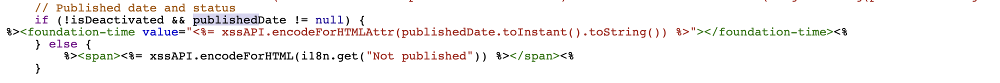

# How to customize the display format of the page published date on the Sites console?

## Description {#description}

### Environment

- Adobe Experience Manager (AEM) v6.5
- AEM as a Cloud Service

### Issue/Symptoms

A page's published date is displayed in the site console without the time of day.

This article explains how to customize the date/time format of the published date to include the time of day.

## Resolution {#resolution}

Create an overlay for each column and list views.

<b>A. For column view</b>

`/libs/cq/gui/components/coral/admin/page/columnpreview/columnpreview.jsp` is overlaid.

<u>Before</u>:

<u>After</u>:

Add `type="datetime"` attribute to the `foundation-time` tag.

<b>B. For list views</b>

`/libs/cq/gui/components/coral/admin/page/row/row.jsp` is overlaid.

<u>Before</u>:

<u>After</u>:

Add `type="datetime"` attribute to the `foundation-time` tag.

