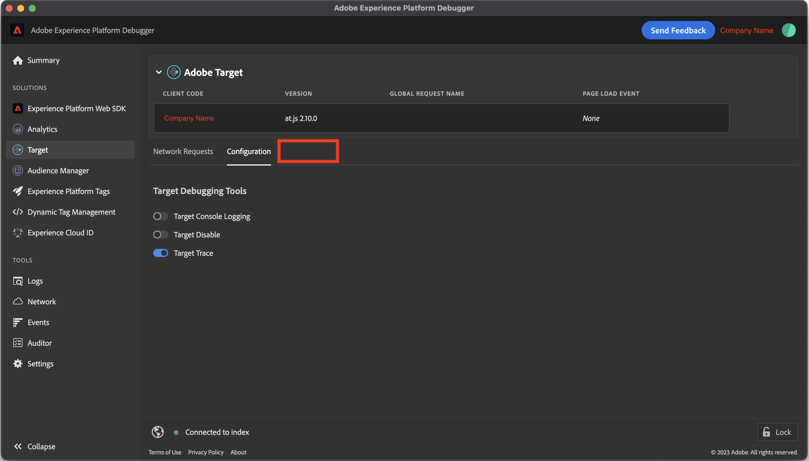

# "Target Traces" does not appear in Adobe Experience Platform Debugger

## Description {#description}

"Target Traces" tab does not appear in Adobe Experience Platform Debugger.
    

## Resolution {#resolution}

Check the following conditions first:

- The user must sign in an organization where Adobe Target is used on the website.
- "Target Trace" toggle switch in Target `>`  Configuration `>`  Target Debugging Tools section must be enabled.

If the issue remains despite above conditions, please try below.

- Create new browser profile

    - On Chrome browser:

        Click profile icon on the top right corner `>`  Click "Add"
    - Install Adobe Experience Platform Debugger extension for the new profile.

        
- Reset browser settings to default

    - On Chrome browser:

        At the top right, select "More" icon and then Settings.

        Select Reset settings `>`  Restore settings to their original defaults `>`  Reset settings.
    - After reset settings, re-enable the Adobe Experience Platform Debugger extension.

