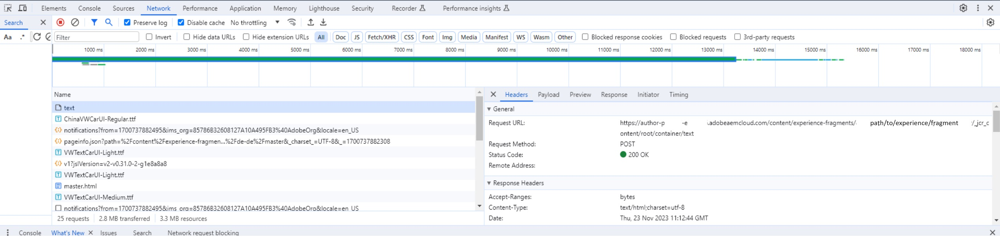

# Performance Issues while editing content

Environment: AEM as a Cloud Service

Version: AEM SDK v2023.8.13206 or older

## Description {#description}

Customers with an AEM SDK version older than version 2023.9.13665 may face performance issues when editing pages.  
 For example, on a new and empty experience fragment, adding a single text component sometimes takes up to 15 seconds until the page is usable again.
 The page stops responding, waits for something, and at some point refreshes.

## Resolution {#resolution}

<b>Troubleshooting:</b>

In the browser developer console, verify which is the most time-consuming request and check the request URL.

For the example above:

Search in the author's error log for the path in the request URL - e.g. /content/experience-fragments/path/to/experience/fragment/_jcr_content/root/container/text

<b>Resolution:</b>

Upon checking the logs it can be seen that the culprit for the delay is `[` 1`]` . The ProcessorUtils waits for the job to be in the index which can take some time depending on the repositories state. On average the minimum wait time is 5 to 7 seconds and then the time it takes for the job to run.

This is a known issue tracked under the internal Jiras - SITES-14804 and GRANITE-45493. Nevertheless, a fix has been implemented and it was included in Oak version 1.54 - `[` 2`]` .

Oak 1.54 was included in AEM sdk version 2023.9.13665.

Therefore, the environment where this issue is encountered needs to be upgraded to a version equivalent to or newer than 2023.9.13665 in order to mitigate this behavior.

`[` 1`]`

`author    aemerror    23.11.2023 11:12:44.432    WARN    [  [ 1700737951330]  POST /content/experience-fragments/path/to/experience/fragment/_jcr_content/root/container/text HTTP/1.1]  com.adobe.cq.updateprocessor.impl.ProcessorUtils Deferred job availability; took 13011ms to become available through index.`

`[` 2`]`

[https://issues.apache.org/jira/browse/OAK-10265](https://issues.apache.org/jira/browse/OAK-10265)
