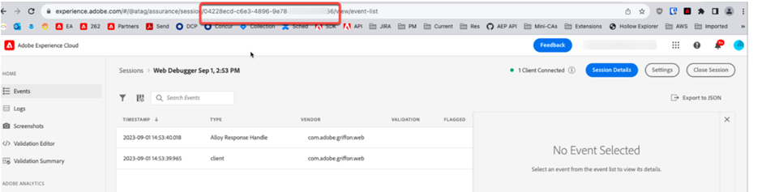

# How can developers view Assurance logs via API?


The article describes how developers can view the Assurance logs via API.

## Description {#description}


### Environment

Adobe Experience Platform Assurance

### Issue/Symptom(s)

How can the Developer Team view the Assurance logs via API?


## Resolution {#resolution}


Follow these steps to achieve this request:

1. Log in to Assurance using [this link](https://experience.adobe.com/assurance).
2. Fetch the assurance ID from the URL as shown below:    
3. Use the following Curl request to send the API request. Replace the `ASSURANCE_ID` parameter with the above assurance ID.<br>    


    ```
    curl --location --request POST 'https://server.adobedc.net/ee/v2/interact?dataStreamId= <YOUR_DATASTREAM_ID>&debugSessionId=<ASSURANCE_ID>'
    ```
4. The API response will contain the Assurance logs.


Reach out to Customer Care if you have any further questions.
