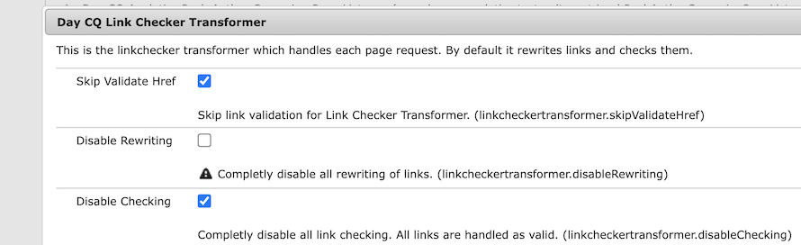

# Adobe Experience Manager: How to bypass URL validation for special characters by the LinkChecker

## Description {#description}

  A custom component might need to render a link containing special characters that are invalid for a URL. Even if the 'Disable Checking' option in the LinkChecker configuration is set to true, the LinkChecker still validates and removes the link from the rendered HTML.         Example:  A link that includes the characters "{" and "}" that are not valid for a URL.   `<` span`>` `<` a href="{testURL}"`>` TEST URL`<` /a`>` `<` /span`>`      The LinkChecker will remove the link from the rendered HTML.  `<` span`>` `>` TEST URL`<` /span`>`      A URISyntaxException is then logged in error.log as a consequence of this validation process.     23.01.2024 12:43:34.500 \*WARN\* `[` 000.000.000.000 `[` 1705981414300`]`  GET /content/wknd/language-masters/en/test.html HTTP/1.1`]`  com.day.cq.rewriter.linkchecker.impl.LinkCheckerImpl Ignoring malformed URI: java.net.URISyntaxException: Illegal character in path at index 0: {testURL}  This article explains how to bypass the URL validation and keep the link intact     <b>Environments</b>  AEM as a Cloud Service, AEM 6.5.17    

## Resolution {#resolution}

Add 'x-cq-linkchecker="skip"' attribute to the link in the HTL of your component. This attribute instructs the LinkChecker to bypass the URL validation completely.   Example: A link that uses the characters "{" and "}" that are invalid for a URL.  `<` span`>` `<` a x-cq-linkchecker="skip" href="{testURL}"`>` TEST URL`<` /a`>` `<` /span`>`    The link remains in the rendered HTML. `<` span`>` `<` a x-cq-linkchecker="skip" href="{testURL}"`>` TEST URL`<` /a`>` `<` /span`>`    