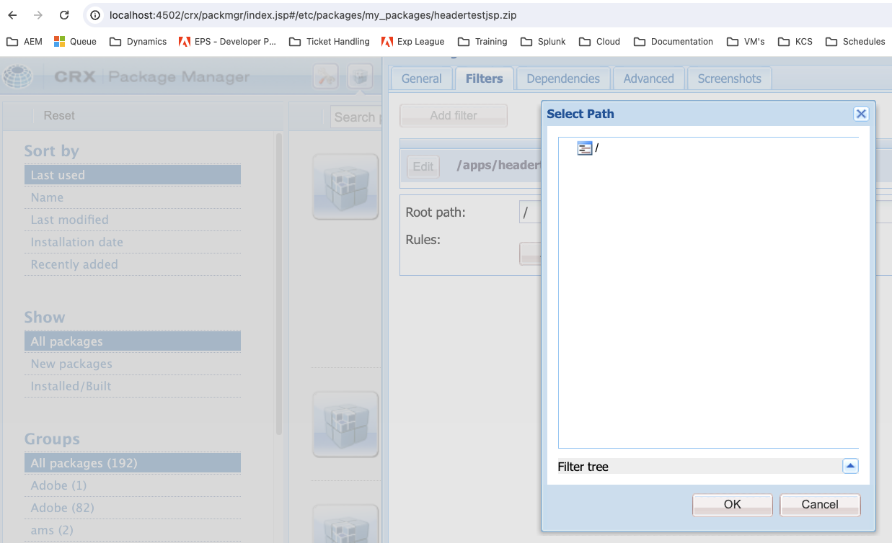

# Unable to view subdirectories in Package Manager when creating new filters

In Adobe Experience Manager (AEM), administrators may encounter an issue where subdirectories are not visible in the Package Manager UI while trying to add new filters. This article provides a resolution for users needing to create packages that include subdirectories.

## Description {#description}

### Environment

Adobe Experience Manager (AEM)

### Issue

When using the AEM Package Manager to create new filters for a package, the user interface may only show the root directory, preventing the selection of subdirectories.

Upon inspection of this window, you can see in the browser developer tools that the /crx/de/tree.jsp file is not found.

You will also see a similar error when trying to load the CRX/DE application (ie. http://`<` hostname/crx/de/index.jsp).

This behavior can hinder the ability to create comprehensive packages for deployment or distribution.

## Resolution {#resolution}

To resolve this issue, follow these steps:

1. Go to your bundles (http://localhost:4502/system/console/bundles).
2. Search for "crx".
3. Ensure that the [Adobe Granite CRXDE Lite (*com.adobe.granite.crxde-lite)*](http://localhost:4502/system/console/bundles/241) bundle is running.
4. Retry the use case.

Your CSE may also be able to temporarily enable this for you.

<b>Note:</b> AMS policy is to disable CRX/DE bundles on production systems. It is crucial to follow security best practices when enabling CRX DE Lite on production environments. Access should be restricted to necessary administrative tasks and the explorer should be disabled immediately after use.
